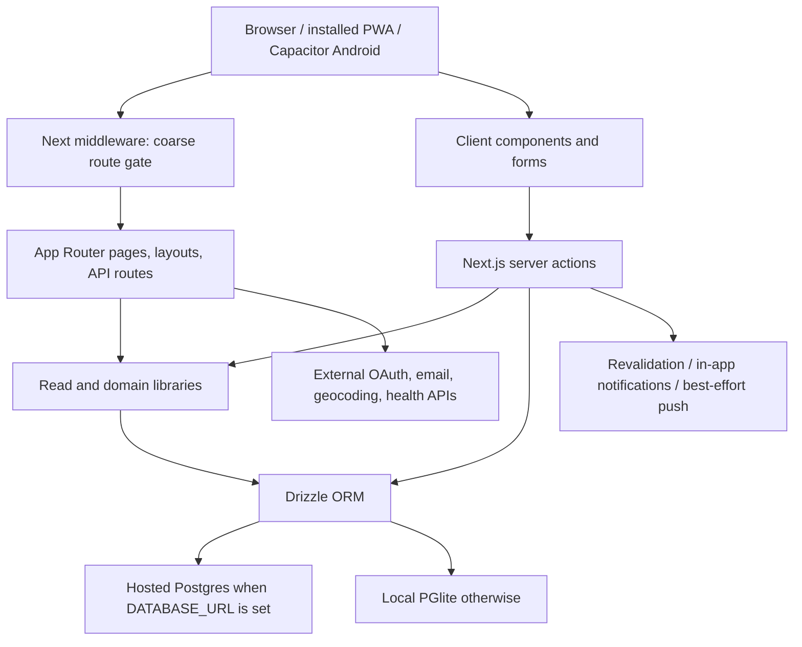

# Architecture

## System shape

MacroVerse is a server-first Next.js 15 App Router application with React 19. The same deployed web application serves browsers, the installable PWA, and a Capacitor Android WebView. Drizzle targets hosted Postgres when `DATABASE_URL` is set and embedded PGlite otherwise.

## Request boundaries

### Reads

Server route pages call `getCurrentUser()` when anonymous rendering is allowed and `requireUser()` when authentication is required. Role-restricted pages use `requireModerator()` or `requireAdmin()`. Data is read through Drizzle directly for localized admin/detail pages or through:

- `src/lib/queries.ts` for feed, recipes, diary, progress, profiles, notifications, and comments.
- `src/lib/restaurants.ts` for geospatial search, fit scoring, build computation, and orders.
- `src/lib/workouts.ts` for workout lists, summaries, exercises, logs, and PR detection.
- `src/lib/challenges.ts` and `src/lib/groups.ts` for leaderboard and authority logic.
- `src/lib/integrations/sync.ts` for connected accounts and normalized import application.

Next layouts and pages can render in parallel. A layout redirect is not a security boundary for its child page; protected pages must guard themselves.

### Writes

Client forms invoke functions in `src/actions`. The expected sequence is:

1. Parse and validate untrusted form/input data.
2. Authenticate with `requireUser`, `getCurrentUser`, or a stronger permission assertion.
3. Load the target row and verify ownership, role, visibility, and subject type.
4. Perform related writes in a transaction when partial completion would break counters or relationships.
5. Create notifications or best-effort push side effects where appropriate.
6. Revalidate every route whose server-rendered data changed; redirect only after the write is complete.

Server actions are not private merely because the UI hides a button. Authorization belongs inside each action.

## Public and authenticated rendering

`src/middleware.ts` allows anonymous browsing under `/recipes`, `/workouts`, `/restaurants`, `/meal-prep`, and `/discover`, except creation/logging subroutes. It otherwise redirects requests without an `mm_session` cookie to `/login`.

The middleware only checks cookie presence. `src/lib/auth.ts` validates token hash, expiry, user/profile existence, and ban state. The main layout renders either an anonymous browse shell or the authenticated navigation shell. Interactions on public pages still require authentication in their server actions.

## Persistence strategy

- Drizzle's schema and query behavior are shared between local and hosted environments.
- During `NEXT_PHASE=phase-production-build`, `src/db/client.ts` exposes a fail-fast build-analysis proxy instead of opening either database. Next evaluates server modules in multiple short-lived build workers; eagerly opening the local single-process PGlite store caused successful builds to finish with misleading WASM `unreachable`/`Aborted()` shutdown warnings. Dynamic routes create the real connection at runtime, and an accidental build-time query now fails with a targeted error.
- TypeScript property names are camelCase; database identifiers use snake_case via Drizzle casing configuration.
- No checked-in migration history currently drives deployment. `drizzle-kit push` compares/pushes `src/db/schema.ts`; operational schema application is separate from web deployment.
- Several interaction relationships are polymorphic (`subjectType` + `subjectId`) and cannot use database foreign keys. Application validation is mandatory.
- Denormalized counters support list ranking and display. Actions that change interactions must keep counters consistent.
- Nutrition diary rows and saved order macro fields are snapshots for stable historical rendering.
- Workout structures/log entries and integration settings use typed JSONB documents when rows are normally written/read as units.

See [Data model](data-model.md) for table groups and lifecycle rules.

## UI architecture

Most pages are async server components. Client components are used for forms, local state, sheets/dialogs, motion, barcode scanning, browser geolocation/maps, toasts, haptics, and native plugin calls. Shared styling is Tailwind CSS 4 plus CSS variables in `src/app/globals.css`; `src/components/ui.tsx` provides common primitives.

The main layout preloads current streak, unread notifications, and frequent foods for global navigation and the log sheet. Route-level `loading.tsx` files cover high-traffic async pages.

## External boundaries

- Authentication email: direct Resend REST call in `src/lib/authEmail.ts`; console links in non-production or explicit console mode.
- Google sign-in: OAuth authorization/callback API routes; only identity data is retained.
- Restaurant geocoding: Nominatim/OpenStreetMap from `src/lib/restaurants.ts`; Leaflet renders maps client-side.
- Barcode lookup: local database/fallback behavior in the barcode action and browser/native scanners in `BarcodeScanner`.
- Health services: provider adapters normalize data before persistence. Token refresh and complete webhook behavior are not universal; consult [Platform and integrations](platform-and-integrations.md).
- Push: FCM HTTP v1 with service-account credentials; notification creation must not depend on push succeeding.

## Native delivery

The Capacitor Android package loads `capacitor.config.ts` `server.url`, which defaults to production. `capacitor/www/index.html` is only a bundled offline/retry fallback. The `MacroVerseApp` user-agent suffix lets server/UI code recognize the wrapped app. Native and deployed web versions can briefly differ, so native calls must degrade safely when a plugin or corresponding web code is unavailable.

## Extension checklist

- Place behavior in the existing domain before inventing a new service layer.
- Reuse snapshot, unit conversion, interaction, moderation, and integration idempotency rules.
- Add page-level and action-level authorization independently.
- Update schema, seed/reference data, route/action catalogs, and status documentation together when applicable.
- Test the server/client serialization boundary; Postgres aggregate values sometimes arrive as strings and should be normalized before client props.
