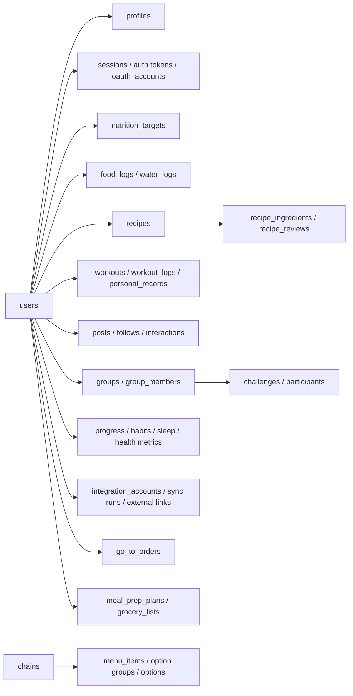

# Data model

`src/db/schema.ts` is the schema source of truth. Drizzle maps camelCase properties to snake_case identifiers. Local PGlite and hosted Postgres use the same schema; `npm run db:push` applies it.

## Relationship overview

The diagram shows ownership, not every foreign key. Polymorphic subjects and a few deliberately loose JSON/document references are enforced in application code.

## Identity and profile tables

| Table | Purpose | Key lifecycle/constraints |
|---|---|---|
| `users` | Login identity, global role, reputation, ban state | Unique email; cascades most user-owned data. `isGuest` remains for legacy compatibility but current UX does not create guest accounts. |
| `sessions` | Application sessions | Raw cookie token is never stored; token hash is PK; cascades with user; expiry checked on every current-user load. |
| `email_verification_tokens` | One-time verification links | Hashed token, expiry, used timestamp; indexed per user/time. |
| `password_reset_tokens` | One-time reset links | Same lifecycle pattern as verification. |
| `oauth_accounts` | External sign-in identities | Composite PK `(provider, provider_account_id)`; points to app user; not a provider-session table. |
| `rate_limit_events` | Persistent abuse-control events | Indexed by kind/identifier/time and cleanup time. |
| `profiles` | One-to-one public/private profile and onboarding state | User ID PK; unique username; canonical body measurements are metric; avatar is currently a compact data URL. |
| `nutrition_targets` | Historical target revisions | Multiple rows per user; the newest `created_at` is current. |

Account deletion cascades through most user-owned rows. Tables with audit/community reasons may set user references null instead. Review `src/actions/account.ts` and table `onDelete` behavior before adding user data.

## Social and media tables

| Table | Purpose | Key lifecycle/constraints |
|---|---|---|
| `follows` | Directed social graph | Composite PK follower/followee. |
| `posts` | Home or group feed content | Optional loose references (`ref_type/ref_id`, `group_id`); soft moderation via `is_removed`; cached comment/reaction counts. |
| `comments` | Comments on posts or recipes | Polymorphic subject; action validates subject. |
| `reactions` | One reaction per user/subject | Composite PK; changing kind updates same logical reaction. |
| `votes` | Up/down vote per subject | Composite PK; used by recipes, workouts, and meal-prep plans through subject type. |
| `saves` | Saved subject per user | Composite PK; used across recipes, workouts, meal prep, restaurant items/orders. |
| `photos` | Media metadata and privacy | Progress rows reference private R2/local objects with server-generated `progress/{userId}/{photoId}.webp` keys; raw keys are server-only. Object cleanup accompanies photo/account deletion. |
| `media_attachments` | Photo-to-subject join | Polymorphic subject; progress attachments must resolve to a progress entry owned by the same user as the photo. Multiple photos may attach to one dated entry. |
| `notifications` | In-app notification inbox | Optional actor, subject metadata, href, read timestamp. |
| `app_settings` | Small admin-owned configuration values | Welcome notification enabled/title/message/href values use named keys and record the last updater/time. |
| `notification_broadcasts` | Admin send history | Records validated user/group/site audience, copy, link, sender, and delivered recipient count. |
| `badges` | Admin-defined achievement catalog | Emoji or compact image icon; manual or automatic metric/threshold; inactive definitions remain stored but hidden. |
| `user_badges` | Persistent badge awards | Composite key user/badge prevents duplicates; source distinguishes automatic/manual and optional admin actor records assignment. |
| `device_tokens` | FCM installation tokens | Token PK; upsert moves a device token to the signed-in user; invalid tokens are pruned lazily. |

Polymorphic tables do not have database FKs to subjects. Deleting a subject must explicitly consider comments, reactions, votes, saves, attachments, reports, warnings, and notifications.

## Nutrition and recipe tables

| Table | Purpose | Key lifecycle/constraints |
|---|---|---|
| `foods` | Shared searchable nutrition catalog | Optional barcode; source and verified flags; macro and sparse FDA-label micronutrient fields. |
| `food_logs` | User diary entries | Snapshot name, servings, macros, and micronutrients at log time; optional source IDs are provenance only. Never recalculate history. |
| `water_logs` | Daily water total | Composite PK user/date; stored in milliliters. |
| `recipes` | Community recipe definition | Per-serving denormalized nutrition, optional compact cover image, provenance/confidence, tags, ranking counters, publication status. |
| `recipe_ingredients` | Ordered ingredient lines | May link a shared food or private personal ingredient; raw text is retained; grams enable calculation. |
| `recipe_reviews` | Tried/rating state | One row per recipe/user; rating nullable for “tried” without rating. |
| `personal_ingredients` | Private repeat-use ingredients | Owned by user; unverified; canonical serving grams and macros. |

The micronutrient column set is intentionally sparse. `null` means unknown, not zero. `src/lib/nutrients.ts` owns definitions, snapshots, totals, and daily-value display behavior.

Recipe macros are stored per serving. `macro_source` distinguishes ingredient-calculated, creator-entered, and verified values; confidence supports UI trust cues. Recipe interactions update denormalized counters and must stay consistent with `votes`, `saves`, reviews, and log creation.

## Restaurant tables

| Table | Purpose | Key lifecycle/constraints |
|---|---|---|
| `chains` | Restaurant brands | Unique name and verification marker. |
| `restaurants` | Physical locations | Chain FK, coordinates, address/source; geo index is a plain lat/lng index, not PostGIS. |
| `menu_items` | Fixed or buildable catalog items | Chain FK; default/per-item nutrition, combo group, provenance/verification. |
| `menu_item_option_groups` | Builder choice groups | Min/max choices and ordering. |
| `menu_item_options` | Additive choices | Per-option macro contribution and defaults. |
| `go_to_orders` | User-saved multi-item builds | JSON item document plus macro snapshot; public/private; log count supports popularity. |

`computeBuilds` and action validation enforce builder choice semantics. Saved order snapshots prevent list rendering and repeat logging from depending on future menu edits.

## Progress, sleep, and health tables

| Table | Purpose | Key lifecycle/constraints |
|---|---|---|
| `progress_entries` | Measurements and notes | Metric storage; manual or provider source; multiple entries per date are possible. |
| `habits` | User-defined/default habits | Archived instead of deleted in normal UI. |
| `habit_logs` | Daily completion | Composite PK habit/date. |
| `fasting_windows` | Active/completed fasts | Null `ended_at` means active; target hours stored on the window. |
| `sleep_logs` | Night summary keyed by wake date | Composite PK user/date; local `HH:MM` strings plus authoritative duration minutes. Manual row takes precedence during import. |
| `daily_health_metrics` | Daily steps/energy/heart metrics | Provider/source metadata; external import links support idempotency. |
| `sleep_stage_samples` | Fine-grained stages | Provider IDs and timestamp interval per stage. |

## Workout tables and JSON documents

| Table | Purpose | Key lifecycle/constraints |
|---|---|---|
| `exercises` | Exercise/activity reference catalog | Unique name; muscle/equipment metadata; activity type drives logger behavior. |
| `workouts` | Community routines and official templates | Nullable author means official; typed JSONB structure; counters/status; optional fork origin. |
| `workout_logs` | Completed/freeform sessions | Typed JSONB entries; optional source workout; provider provenance. |
| `workout_routes` | Imported route geometry/metadata | Private by default; start/end privacy distances; polyline or future GPX storage key. |
| `personal_records` | Queryable extracted PRs | Per user/exercise/metric history linked to source log. |

Workout structure is a planned document. Log entries are discriminated strength, cardio, or mobility documents; legacy strength entries remain readable. PR detection supports estimated 1RM, volume, and repetitions. Holds do not generate rep/e1RM records.

## Planning tables

| Table | Purpose | Key lifecycle/constraints |
|---|---|---|
| `grocery_lists` | User-owned list container | Current UI creates/uses a default list. |
| `grocery_items` | Manual or recipe-derived list rows | Purchase state, optional quantity/section/cost and source recipe. |
| `meal_prep_plans` | Shareable multi-recipe plans | Optional compact cover image plus denormalized per-serving macro/cost/prep totals and interaction counters. |
| `meal_prep_items` | Ordered recipes in a plan | Composite PK plan/position; servings controls contribution. |

## Groups, challenges, and moderation

| Table | Purpose | Key lifecycle/constraints |
|---|---|---|
| `groups` | Community containers | Unique slug, kind, cached member count, creator. |
| `group_members` | Membership and local role | Composite PK; role is member/moderator/owner. |
| `challenges` | Global or group behavior challenge | Metric, target/unit, date window. Weight-loss amount is intentionally not a metric. |
| `challenge_participants` | Enrollment/progress | Composite PK; auto-scored metrics recompute from logs, custom check-in uses stored progress/date. |
| `reports` | User moderation reports | Polymorphic subject, reason/detail, open/actioned/dismissed review lifecycle. |
| `moderation_actions` | Audit trail | Actor may be null after deletion; links optional report; immutable event-style row. |
| `content_warnings` | Subject warning labels | Composite PK subject/type/kind. |
| `feedback` | Product feedback | User may be null; open/reviewed/actioned state. |
| `nutrition_import_batches` | Admin import audit | Filename, counts, target, and structured row errors. |

## Integration tables

| Table | Purpose | Key lifecycle/constraints |
|---|---|---|
| `integration_accounts` | Connected health provider account | Encrypted tokens, scopes, typed sync settings, cursor/status timestamps. |
| `integration_sync_runs` | Each backfill/manual/webhook/mobile run | Running/success/error, counts, error message. |
| `external_sample_links` | Idempotency and provenance map | Composite PK provider/external ID/subject type; maps provider samples to local rows. |

Imported data follows these precedence rules:

- Existing external links prevent duplicate workouts, routes, stage samples, and progress entries.
- Daily metrics update an already linked row.
- Manual sleep for a date is never overwritten by a provider.
- Manual progress for a date blocks an imported progress row.
- Disconnecting an account clears tokens and disables the account but preserves imported data and audit runs.

## Schema change checklist

1. Modify `src/db/schema.ts` and consider both Postgres and PGlite behavior.
2. Update every read, write, seed, import, deletion, and serialization path.
3. Decide FK deletion behavior and cleanup for polymorphic relations.
4. Update `scripts/seed.ts` if the field/table is required for reference or demo flows.
5. Apply locally with `npm run db:push` while the dev server is stopped.
6. Typecheck, build, and run relevant E2E tests.
7. Plan production `db:push` separately from application deployment.
8. Update this document and [Status and roadmap](status-and-roadmap.md) if rollout state differs from code state.
