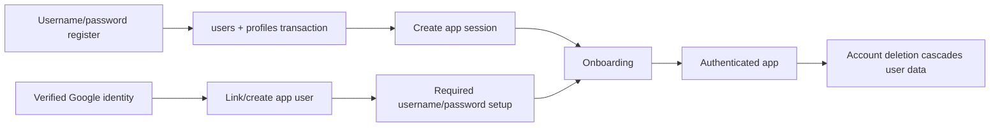

# Identity and profiles

## Scope and entry points

This domain owns username/password and Google sign-in/link/recovery, app sessions, onboarding, nutrition targets, profile/settings changes, avatar data, and account deletion.

Username/password and Google are always available. Local registration needs no email and creates an app session immediately. Google-created users must choose their public username and a fallback password before any normal authenticated page or mutation accepts the session.

- Routes: `/login`, `/register`, `/account-setup`, `/forgot-password`, `/onboarding`, `/settings`, `/u/[username]`, `/privacy`; verification/reset-token routes remain only for already-issued legacy links.
- API routes: `/api/auth/google/start`, `/api/auth/google/callback`, `/api/account/export`.
- Actions: `src/actions/auth.ts`, `account.ts`, `onboarding.ts`.
- Libraries: `src/lib/auth.ts`, `authTokens.ts`, `googleAuth.ts`, `passwords.ts`, `targets.ts`, `units.ts`.
- Tables: `users`, `sessions`, legacy verification/reset tokens, `oauth_accounts`, `oauth_authorization_flows`, `rate_limit_events`, `profiles`, `nutrition_targets`.

## Account lifecycle

Registration lowercases the public/login username, validates a 12–64-character password (and bcrypt's 72-byte input ceiling), and creates the user/profile transactionally with `users.email = null`. It creates the welcome notification and authenticated session, then continues through onboarding and a safe remembered destination.

Username login joins `profiles` to `users`, uses independent request and normalized-username rate limits, and performs a dummy bcrypt comparison for unknown accounts. Email is never a login identifier. Existing verification/reset token tables and consumption routes remain for links already issued, but the application no longer mints or emails new tokens.

Google sign-in links a provider account to an existing verified legacy email or creates the local identity/profile path defined in the callback. A newly created Google account receives the same welcome notification and app session, then must finish `/account-setup`. Existing passwordless Google accounts are subject to the same gate and must freshly verify Google before adding a password from an older session.

Google callback failures are translated into allow-listed, actionable login messages. Raw provider details are not rendered. Safe `next` values continue through the OAuth start cookie; new Google users complete onboarding before the remembered destination, while onboarded returning users go directly to it.

## Recovery and credential changes

Local users can explicitly connect one Google identity in Settings. Recovery mode signs in only an already-linked provider identity and never creates or auto-links an account. Password replacement requires the current password or a Google/password authentication recorded on the session within ten minutes, then revokes all sessions and creates one fresh browser session. An unlinked local account has no logged-out recovery channel.

## Sessions and bans

The cookie name is `mm_session`; only the token hash is stored. `getCurrentUser()` also rejects a banned user, effectively invalidating access even if an existing session row remains. Logout deletes the current session row and cookie.

Middleware is not validation. Every page under this domain that exposes private data must call `requireUser()` or a stronger guard, and every action must do the same.

## Onboarding and targets

`src/components/OnboardingWizard.tsx` collects goal, tracking style, dietary preference, activity/biometric information, and units. `completeOnboarding()` writes profile state and creates a target row. The main layout redirects an authenticated user without `profile.onboardedAt` back to `/onboarding`.

Targets are revisions, not a mutable singleton: the newest row is current. `src/lib/targets.ts` calculates estimates from profile inputs and enforces a 1,200 calorie floor. Manual target updates create rows with `isManual`. Profile-driven recalculation and manual overrides must preserve that history.

Canonical height/weight measurements are metric. Forms use `src/lib/units.ts` to translate imperial input and display. Never store pounds or inches in metric-named fields.

Tracking style affects presentation and product emphasis. Known values include strict macros, calorie only, protein focused, habit, maintenance, performance, and no-scale. No-scale behavior should suppress weight-centric UI rather than destroying existing measurements.

## Profile visibility and public reads

Profiles have unique usernames and a visibility setting. Public profile pages combine profile data, follow state/stats, posts, and domain content. When extending these reads, enforce visibility and ban/removal behavior before returning personal targets, measurements, or activity.

Avatars currently use a compact data URL stored on `profiles.avatar_url`. `photos`/attachments are a broader media foundation but not yet a complete external upload pipeline.

## Settings and deletion

Settings forms update profile details, biometrics, targets, units, visibility, and avatar, and expose integrations/account deletion. Account deletion requires a deliberate confirmation in `src/actions/account.ts` and removes the user row, relying on schema cascade/set-null rules. Audit/community rows may outlive the user with null actor/reporter fields.

The public `/privacy` policy describes collected categories, uses, service-provider sharing, retention, user choices, security, children, and contact. Signed-in users can download a versioned JSON snapshot from Settings. `src/lib/accountExport.ts` scopes direct rows to the current user and child rows through owned parents. It includes the user's relationship IDs and already-delivered inbox messages but not another user's profile/account rows. Sensitive infrastructure records and credential fields are excluded by design; the response is an attachment with private/no-store caching.

Before changing deletion or export, inventory every table in [Data model](../data-model.md), third-party connection, and storage object. Keep the privacy policy consistent with actual collection, sharing, retention, export, and deletion behavior.

## Safe change checklist

- Keep user/profile creation atomic.
- Keep session tokens and public email tokens hashed at rest.
- Keep linked-Google recovery responses generic and never create/link an account in recovery mode.
- Do not link an OAuth identity to an unverified local email.
- Use persistent rate limits for auth endpoints.
- Add new profile values to onboarding, settings, display, seed data, and target recalculation as applicable.
- Add new user-owned data to the export, but never switch sensitive tables to unrestricted `select()` projections.
- Test both anonymous and authenticated rendering; the main layout supports both.
