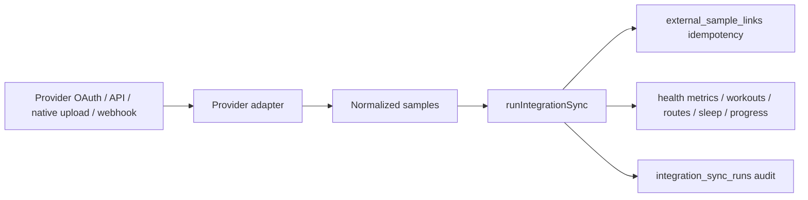

# Platform and integrations

## Web, PWA, and service worker

The Next.js application is the product runtime. `public/manifest.webmanifest`, icons, and `public/sw.js` make it installable as a PWA. `PwaRegister` registers the service worker only in production. The service worker provides an offline shell/cache strategy; server-rendered and authenticated data still requires the network.

Security headers are defined in `next.config.ts`. New remote API, image, font, script, style, or map requirements must be reflected in CSP and verified in a production build/browser.

## Capacitor Android shape

`capacitor.config.ts` defines a remote-URL shell:

- app ID: `com.macroverse.app`;
- app name: MacroVerse;
- default `server.url`: `https://macroverse.vercel.app`;
- `CAP_SERVER_URL`: optional build/dev override;
- `webDir`: `capacitor/www`, used for bundled offline/retry fallback;
- appended user-agent token: `MacroVerseApp`;
- cleartext enabled only when the selected server URL starts with `http://`.

`src/components/NativeInit.tsx` initializes native-only behavior such as splash hiding, status bar, back button, keyboard, deep-link navigation, and push registration when plugins are available. `src/lib/native.ts` distinguishes runtime platform and user agent; haptics and review prompts are best-effort wrappers.

Because the shell loads the deployed site, changing `src` does not change an installed production app until the site is deployed. Conversely, deployed web code may run inside an older shell. Guard plugin calls and tolerate missing native capability.

Android source lives in `android`; generated splash/icon assets live in Android resources and source art lives in `assets`. `android/app/google-services.json` and `android/keystore.properties` are intentionally ignored secrets/local configuration.

## Push notifications

`registerDeviceToken()` upserts FCM tokens to the current user. `src/lib/push.ts` creates a Google service-account JWT, obtains an OAuth token, sends FCM HTTP v1 messages, and removes invalid/unregistered device tokens. Required server variables are `FCM_PROJECT_ID`, `FCM_CLIENT_EMAIL`, and `FCM_PRIVATE_KEY`.

Push is an optional delivery channel layered on durable `notifications`. Mutations should succeed even when FCM is unconfigured or delivery fails. Firebase/FCM launch verification is currently deferred; see [Status and roadmap](status-and-roadmap.md).

## Integration architecture

Health/wearable providers implement the `ProviderAdapter` contract in `src/lib/integrations/types.ts`:

- metadata: provider, label, availability, advertised metrics/scopes;
- optional OAuth authorization URL and code exchange;
- optional backfill fetch;
- optional webhook normalization.

All external payloads become one of four normalized sample kinds before persistence: daily metric, workout, sleep, or progress. `src/lib/integrations/sync.ts` owns connected accounts, encrypted token persistence, sync runs, precedence, idempotency, and local row creation.

## Provider readiness

| Provider | Descriptor | Implemented code path | Important gaps/conditions |
|---|---|---|---|
| Strava | `web_oauth` | OAuth exchange; activity backfill normalization for run/ride/walk/hike/row; route polyline import | No token refresh; webhook update normalization currently returns no samples; credentials/subscription need external setup |
| Fitbit | `web_oauth` | OAuth exchange; step and sleep backfill | Descriptor advertises more metrics than backfill currently imports; no token refresh; external app setup required |
| Apple Health | `native` | Normalized mobile-upload API can accept provider samples | Native collection/permission bridge is not established by the server foundation alone |
| Health Connect | `native` | Same normalized mobile-upload foundation | Native collection/permission bridge requires device-side implementation/verification |
| Garmin | `approval_required` | Descriptor and normalized model only | Provider approval and adapter behavior required |
| WHOOP, Oura, Withings | `planned` | Descriptor only | OAuth/fetch/normalization not implemented |

Do not infer readiness from a provider appearing in settings or its advertised metric array. Code, credentials, provider console configuration, token lifecycle, webhook subscription, and smoke tests are separate requirements.

## OAuth integration routes

- `connectIntegration()` creates a state cookie and redirects to provider authorization.
- `/api/integrations/[provider]/callback` validates state, exchanges code, upserts encrypted account data, then redirects to settings.
- `syncIntegrationAction()` runs a manual backfill for an account owned by the user.
- `disconnectIntegrationAction()` disables the account and clears tokens without deleting imported data.
- `/api/integrations/mobile/upload` authenticates the current app user and applies normalized native samples.
- `/api/integrations/[provider]/webhook` handles verification/payload entry, but useful behavior depends on each adapter normalizer and provider subscription.

## Token encryption and lifecycle

Tokens are AES-GCM encrypted in `src/lib/integrations/crypto.ts`. The key is derived from `HEALTH_TOKEN_ENCRYPTION_KEY`, then `AUTH_SECRET`, then `DATABASE_URL`, with a development fallback. Production should set a stable dedicated key. Rotating it requires an explicit re-encryption/reconnect plan.

Although account rows store expiry and refresh ciphertext, current adapters do not implement refresh. An expired access token will make manual/backfill sync fail and set account/run error state. Do not claim continuous sync until refresh and subscription behavior are complete.

## Native/platform change checklist

- Test in ordinary browser, installed PWA if relevant, and remote Android shell.
- Guard native imports/calls and maintain old-shell/new-web compatibility.
- Verify CSP and permissions policy for new remote endpoints or device permissions.
- Keep third-party secrets and tokens server-side/encrypted.
- Preserve integration idempotency and manual-data precedence.
- Document external console, signing, Firebase, or store prerequisites separately from code completion.
